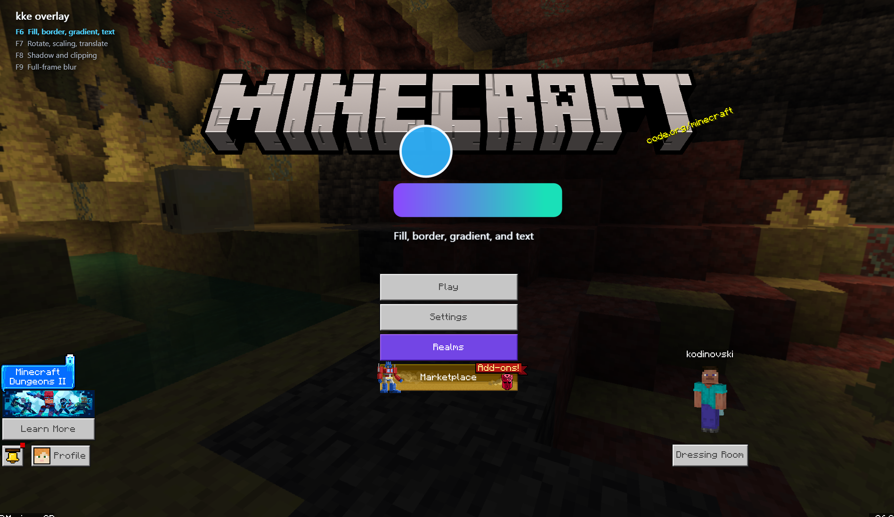

# D3D11 Overlay Example

This example builds an injectable Windows DLL that uses Kiero to discover the Direct3D 11
swap-chain methods, MinHook to detour them, and kke to draw through Direct2D on the current
back buffer.

## Structure

- `Hooks`: installs and removes the Present and ResizeBuffers detours.
- `D2dEntrance`: connects the hooked DXGI swap chain to a kke Direct2D frame.
- `D3d11ContextIsolation`: saves and restores the host application's immediate-context
  state around overlay rendering. Rendering is skipped when this D3D11.1 facility is unavailable.
- `PageController`: handles the function keys, selects a page, and draws the key guide.
- `pages`: contains one renderer for each F6-F9 page.

## Controls

- `F6`: fill, border, gradient, and text
- `F7`: animated rotation, scaling, and translation
- `F8`: shadow and clipping
- `F9`: full-frame blur

The control guide remains visible in the upper-left corner. The example does not clear the
host back buffer and restores the Direct3D 11 device-context state after every overlay frame.

The text sample loads `Segoe UI` from the Windows Fonts directory at runtime, so no font asset
is copied into the DLL.
